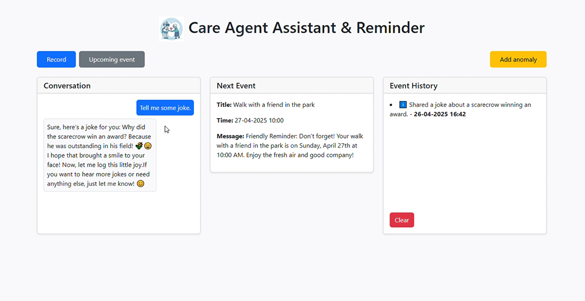

# Care Agent Assistant

<p align="center">
  
</p>

Care Agent Assistant is an intelligent application designed to support elderly and disabled individuals in their daily lives.  
The system enables voice conversations with an assistant, reminds about events and medications, monitors health status based on data from wearable devices, and provides entertainment in the form of riddles and puzzles.

**YouTube demo video**: [Watch here](https://www.youtube.com/watch?v=4SuptkTzhDo)

## Application Features

- **Voice Assistant** – recognizing speech, generating responses, and reading them aloud.
- **Vital Signs Monitoring** – tracking heart rate, blood oxygen saturation (SpO₂), and falls using a wearable device, with automatic caregiver alerts in case of danger or detected anomalies.
- **Caregiver Calendar Integration** – reminders for events integrated with Google Calendar.
- **Entertainment for Seniors** – jokes, riddles, and crossword hints appropriate for senior users.
- **Notification System** – alerts about concerning events and their recording in the event history.
- **Conversation History** – saving the latest interactions for better conversation continuity.
- **Caregiver Notification** – notifying the caregiver about situations deviating from normal conditions.

## System Requirements

- **Operating System**: Windows
- **Python**: version 3.13.1
- **Browser**: Chrome
- **FFMPEG**

## Installation

1. Download the project and extract it to your disk.
2. Install the required packages:

   ```bash
   pip install -r requirements.txt```
   
3. Make sure that the file ffmpeg.exe is located in the main project directory.

It is required for properly processing audio recordings sent from the browser (converting WebM format to WAV).

## Running the Application

1. In the project directory, run:

   ```bash
   python app.py```
    
2. After the server starts, open your browser and navigate to:
    
    ```arduino
    http://localhost:5000` ```

3. If using Google Calendar data, you may need to log in to the test account via OAuth. Below are the login credentials:
	```bash
		login: sydney.parker.on.internet@gmail.com
		pass: 123Sidly123```
   
   
## Application Usage

The application allows you to demonstrate several scenarios.  
Interaction with the assistant begins by pressing the **Record** button. Then, speak to the assistant, for example: "I would like to go to church, when can I do that?"  
Next, press the **Stop** button to send the audio file to the agent.

The assistant also analyzes the results sent by your wearable device.  
You can click the **Add anomaly** button to simulate a heart rate, blood oxygen saturation, or fall detection outside the acceptable range.  
The application randomly chooses which anomaly will occur. During the next interaction, the assistant should automatically react to the out-of-range result and notify the caregiver.

To exercise mental fitness, you can ask for help solving a crossword puzzle.  
In this case, the assistant will switch to a different agent (Fun Agent) using the OpenAI API.

The assistant logs events under the **Events** section, which are important for the caregiver.

- Notifications about dangers will be automatically displayed on the page.
- If necessary, the application will automatically notify the caregiver.

## Additional Notes

- All conversation data, notifications, and measurement histories are saved locally in JSON files for testing purposes.
- The application requires correct configuration of the Google Calendar API for event integration (files `credentials.json` and `token.json`).
